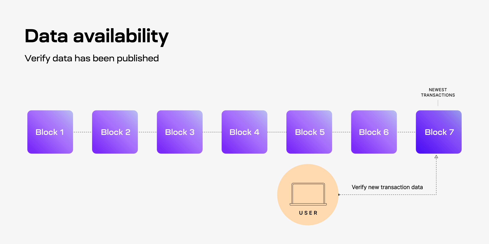
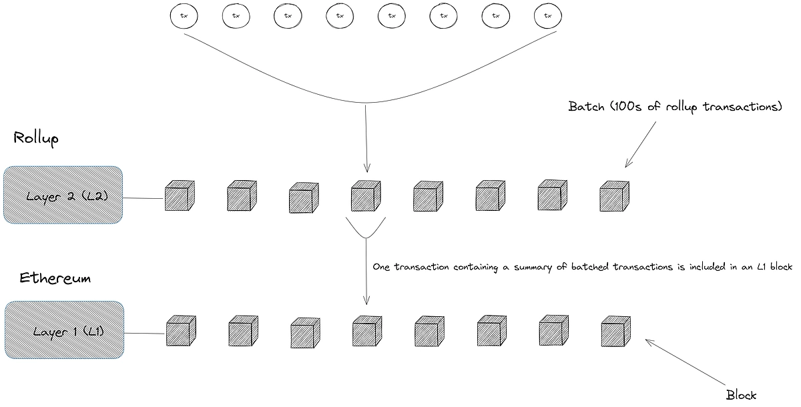

+++
tags = "evm, layer2, 🇻🇳"
date = "5 August, 2024"
+++

# Khả dụng dữ liệu (Data Availability) để làm gì?

Đối với hầu hết các blockchains, các nodes sẽ kiểm tra khả dụng dữ liệu bằng cách tải toàn bộ dữ liệu giao dịch trong một block. Với dữ liệu tải được, những nodes này có thể kiểm tra tính khả dụng cho block đó. Một vài nodes có thể sử dụng phương pháp lấy mẫu, nó sẽ chọn ngẫu nhiên các block để kiểm tra thay vì toàn bộ.

## Vấn đề của các blockchain nguyên khối (monolithic)

Hiện tại PoW Ethereum, Bitcoin là các blokchain với kiến trúc nguyên khối. Tất cả công việc như thuật toán đồng thuận, kiểm tra khả dụng dữ liệu, thực thi giao dịch, vân vân, sẽ được triển khai trên một lớp (layer) duy nhất. Mỗi node sẽ làm một bản sao về dữ liệu của một node khác. Vì vậy, nó làm gia tăng gánh nặng khi tất cả các nodes phải thực hiện liên tục các công việc trùng lặp như tải dữ liệu, kiểm tra dữ liệu, lưu dữ liệu, phản hồi dữ liệu. Kết quả là tiêu tốn băng thông, làm giảm hiệu suất toàn mạng.

Ngoài ra, dữ liệu cho mỗi nodes sẽ tích luỹ rất lớn theo thời gian. Để xử lý, cấu hình phần cứng thường được yêu cầu ở mức cao. Điều này ngăn chặn khả năng tham gia của nhiều thành phần "yếu thế" ví dụ như máy tính cá nhân, thiết bị di động, thiết bị nhúng, và từ đó vô tình dẫn đến một sự tập trung có tính kỹ thuật.

## Ý tưởng về khả dụng dữ liệu

Năm 2022, Ethereum chuyển từ Proof-of-Work sang Proof-of-Stake. Lúc này các nodes trên Ethereum chia quá trình vận hành thành hai lớp: lớp thực thi (Execution Layer) và lớp đồng thuận (Consensus Layer). Trong đó, lớp thực thi sẽ thực hiện các thao tác về chọn lựa và khởi tạo dữ liệu block. Các block này sẽ được chấp thuận bởi lớp đồng thuận - là lớp đặt cọc ETH để có quyền tham gia đồng thuận và duy trì tính bền vững của toàn mạng. Kiến trúc này gợi mở một hướng tiếp cận mới về khả năng mở rộng (Scalability) của blockchain. Các khái niệm về kiến trúc modular blockchain bắt đầu bùng nổ và trong đó, khả dụng dữ liệu là một thành tố quan trọng.

> Blockchain yêu cầu 4 thành tố chính: Thực thi (Execution), Giao ước (Settlement), Đồng thuận (Consensus), và Khả dụng dữ liệu (Data Availability).

## Khả dụng dữ liệu hoạt động ra sao?

Một ví dụ tiêu biểu về cách hoạt động của khả dụng dữ liệu là trong Rollup - Ethereum Layer 2[^1]. Rollup sẽ xử lý các giao dịch trên Layer 2 và đóng gói lại thành những lô giao dịch. Các lô này sẽ được gửi và xác nhận trên mạng chính Ethereum.

Về cơ bản, sau khi được Ethereum xác nhận, thì các giao dịch này được xem là hợp lệ và không cần lưu lại. Tuy nhiên, nếu ai đó chứng minh rằng các giao dịch trên Layer 2 và Ethereum không khớp với nhau, kẻ đóng block sai sẽ phải chịu phạt và người phát hiện sẽ được thưởng. Ở đây, ta thấy rằng các dữ liệu của Layer 2 mặc dù là offchain[^2] nhưng vẫn phải khả dụng đối với các thành phần trong mạng để có thể kiểm tra tính đúng đắn của các blocks.

Lớp khả dụng dữ liệu chính lúc này sẽ tham gia vào hệ thống nhằm lưu trữ toàn bộ các dữ liệu của Layer 2. Mọi người đều có thể trích xuất dữ liệu từ lớp này để kiểm tra trạng thái toàn mạng.

[^1]: Người viết xin giữ nguyên khái niệm này vì chưa tìm được từ tương ứng trong Tiếng Việt.
[^2]: Không khả dụng trên mạng Ethereum.

## Ai sẽ sẵn sàng chạy lớp khả dụng dữ liệu?

Một cách ngắn gọn, mọi người sẽ chạy các node DA nếu họ thấy lợi nhuận. Ví dụ, các Sequencer[^3] sẽ nhận \$OP trên mạng Optimism, hoặc \$ARB trên mạng Arbitrum.

[^3]: Node tổ chức các giao dịch hợp lệ thành lô và lưu trữ toàn bộ lịch sử giao dịch của Layer 2.
